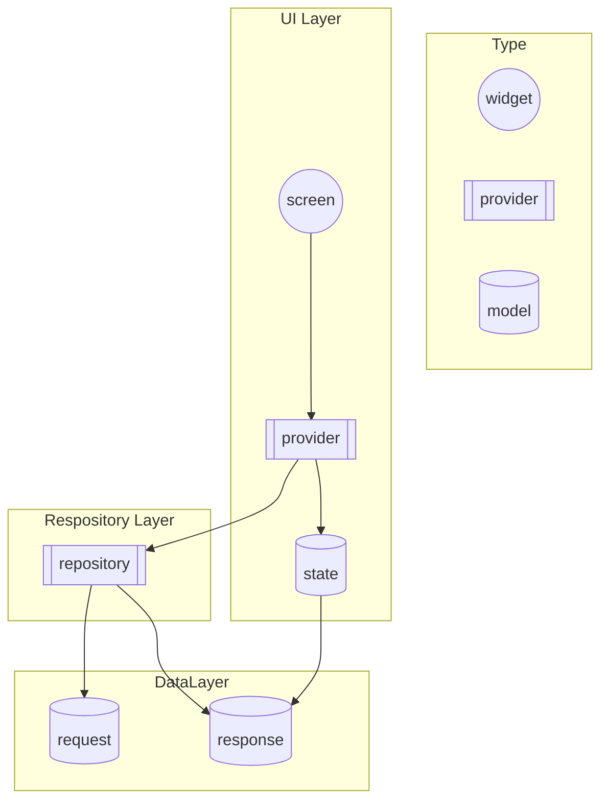

# アーキテクチャ図

# Layer

## UI Layer

最も大きな Widget とそれに伴う Provider, State の集約  
最上位のレイヤーで他のレイヤーから参照されることはない  
小さな Widget に切り出す場合は components 以下に集約する

> [!NOTE]
> mermaid 図から分かる通り state が response モデルに依存しているが、研修では I/F の変更が入らず冗長化の恩恵が薄いためこれを許容する

## Repository Layer

Repository および DI するための provider を集約  
リクエストモデルの生成や Json のシリアライズも責務として担う

## Data Layer

各種モデルを集約  
最下層のレイヤーで全てのレイヤーから参照可能

# プロパイダーの依存関係

[graph.md](./graph.md)を参照してください
