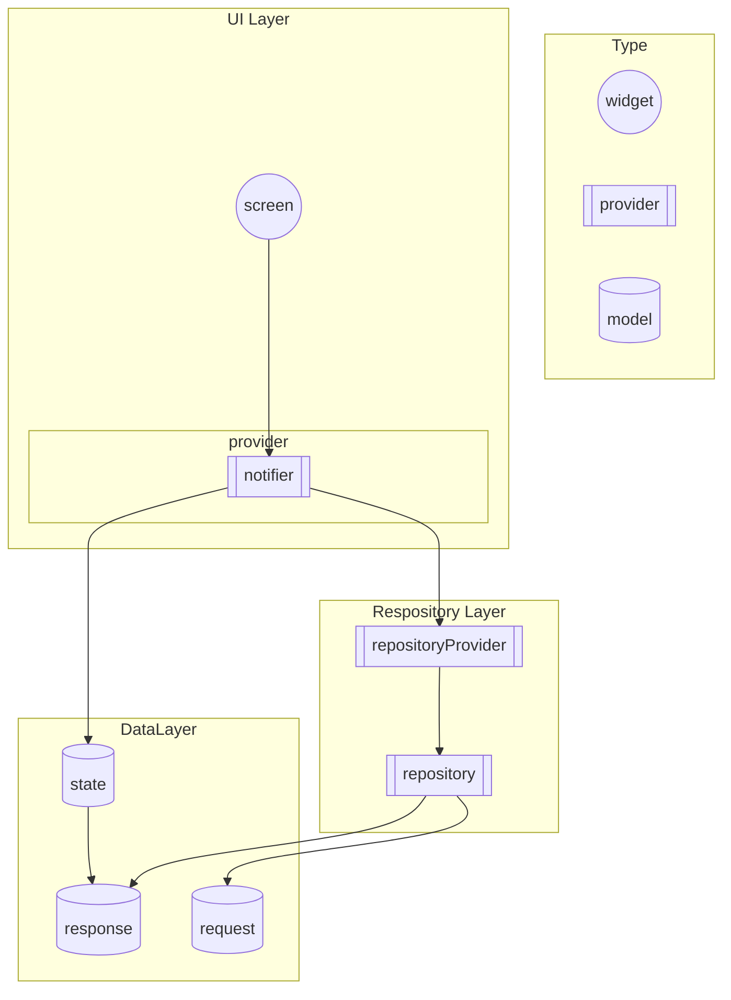

```mermaid
flowchart TB

subgraph Type
direction LR
widgetType((widget))
providerType[[provider]]
modelType[(model)]
end

subgraph UI Layer
    direction LR
    screen((screen))
    subgraph provider
        notifier[[notifier]]
    end
    screen-->notifier
end

subgraph Respository Layer
    repositoryProvider[[repositoryProvider]]
    repository[[repository]]
end

subgraph DataLayer
state[(state)]
request[(request)]
response[(response)]
end

notifier-->state
state-->response
repository-->response
repository-->request

repositoryProvider-->repository
notifier-->repositoryProvider
```

mermaid 図から分かる通り state が response モデルに依存しているが、研修では I/F の変更が入らず冗長化の恩恵が薄いためこれを許容する
