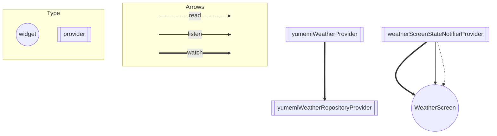

```mermaid
flowchart TB
  subgraph Arrows
    direction LR
    start1[ ] -..->|read| stop1[ ]
    style start1 height:0px;
    style stop1 height:0px;
    start2[ ] --->|listen| stop2[ ]
    style start2 height:0px;
    style stop2 height:0px;
    start3[ ] ===>|watch| stop3[ ]
    style start3 height:0px;
    style stop3 height:0px;
  end
  subgraph Type
    direction TB
    ConsumerWidget((widget));
    Provider[[provider]];
  end

  yumemiWeatherRepositoryProvider[["yumemiWeatherRepositoryProvider"]];
  yumemiWeatherProvider[["yumemiWeatherProvider"]];
  weatherScreenStateNotifierProvider[["weatherScreenStateNotifierProvider"]];
  WeatherScreen((WeatherScreen));

  weatherScreenStateNotifierProvider ==> WeatherScreen;
  weatherScreenStateNotifierProvider --> WeatherScreen;
  weatherScreenStateNotifierProvider -.-> WeatherScreen;
  yumemiWeatherProvider ==> yumemiWeatherRepositoryProvider;
```
